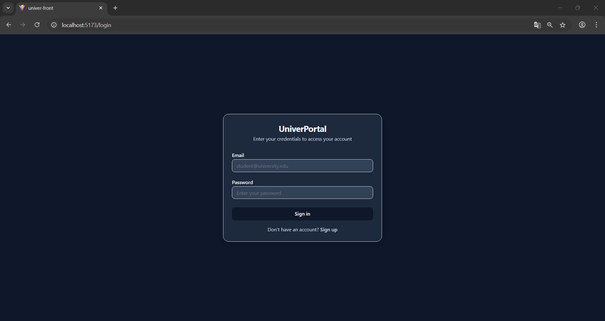
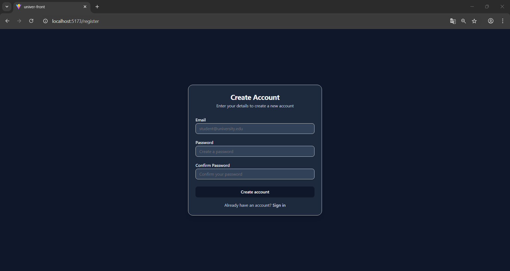
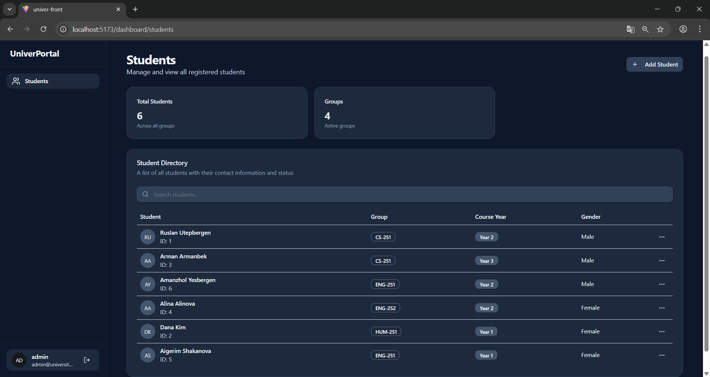
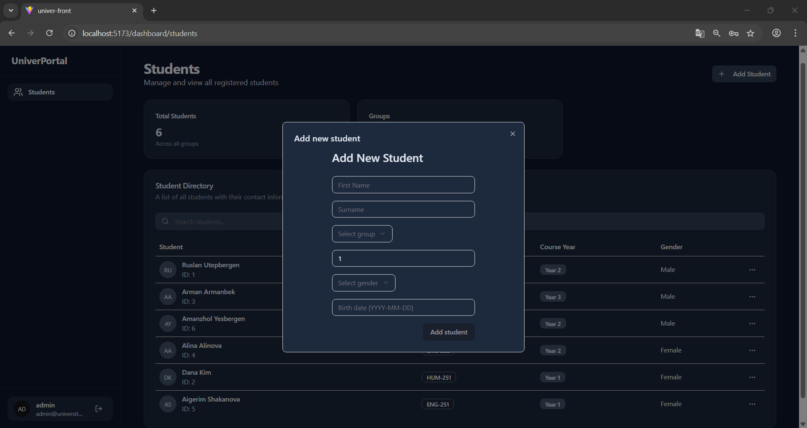
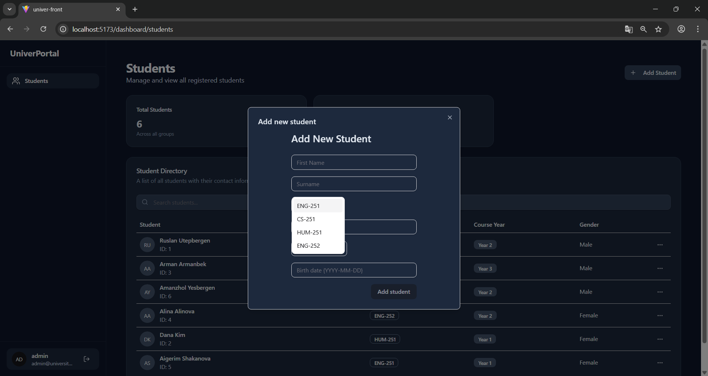

# University portal

A web application for managing students, groups, and their details. Built with **React**, **TypeScript**, and **Tailwind CSS**.

---

## Table of Contents

* [Features](#features)
* [Tech Stack](#tech-stack)
* [Screenshots](#screenshots)
* [Usage](#usage)

---

## Features

* User authentication: **Login** and **Register** pages
* Student management: view, add, and search students
* Group management: view groups associated with students
* Interactive dashboard with statistics
* Modern UI with **Tailwind CSS**

---

## Tech Stack

* **Frontend:** React, Vite, TypeScript, Tailwind CSS, Lucide Icons, Shadcn UI
* **State Management:** React hooks (custom hooks for API calls)
* **Backend:** Golang, echo framework

---

## Screenshots

### Login Page

*Description: Enter your username and password to log in.*

### Register Page

*Description: Create a new account to access the dashboard.*

### Students Dashboard

*Description: Overview of all students, groups, and quick statistics.*

### Add Student Page / Modal

*Description: Form to add new students with details and date picker.*

## Usage

1. Register a new user or log in with an existing account.
2. Navigate to the **Students** page to view all students.
3. Use the **Add Student** button to open a modal form for adding a new student.

---
